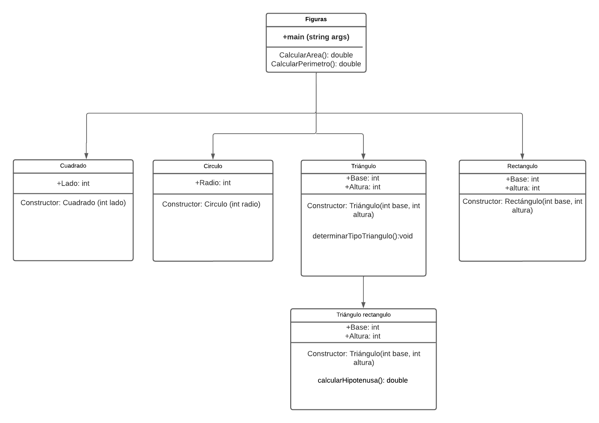

# Trabajos de grupo POO

Repositorio hecho para subir los trabajos de materia de POO en la universidad nacional de colombia sede medellin con el profesor Walter Hugo.

## Estudiantes
- Juan Manuel Vera
- Juan Pablo Mazo Berrio
- Sebastian Arango Urrea

## Información génerica
### Estructura

en src esta estructurado con cada trabajo, que a su vez se forma como un package en el cual cada clase es un punto de algún ejercicio.
lo que significa que en src/trabajo1/parte1 y src/trabajo1/parte2 se encuentra el código respectivo del primer trabajo en equipos

### UML
El uml que hicimos para el trabajo fue el siguiente:

### Folder Structure

The workspace contains two folders by default, where:

- `src`: the folder to maintain sources
- `lib`: the folder to maintain dependencies

Meanwhile, the compiled output files will be generated in the `bin` folder by default.

> If you want to customize the folder structure, open `.vscode/settings.json` and update the related settings there.

### Dependency Management

The `JAVA PROJECTS` view allows you to manage your dependencies. More details can be found [here](https://github.com/microsoft/vscode-java-dependency#manage-dependencies).
